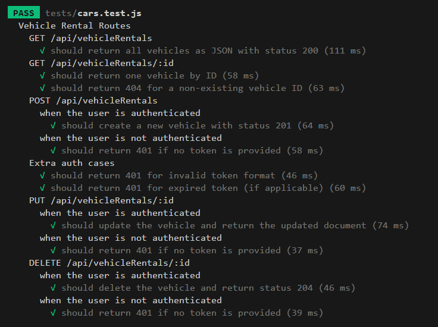
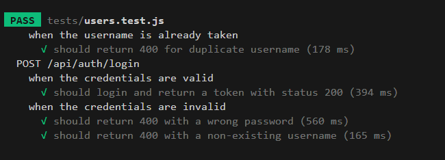
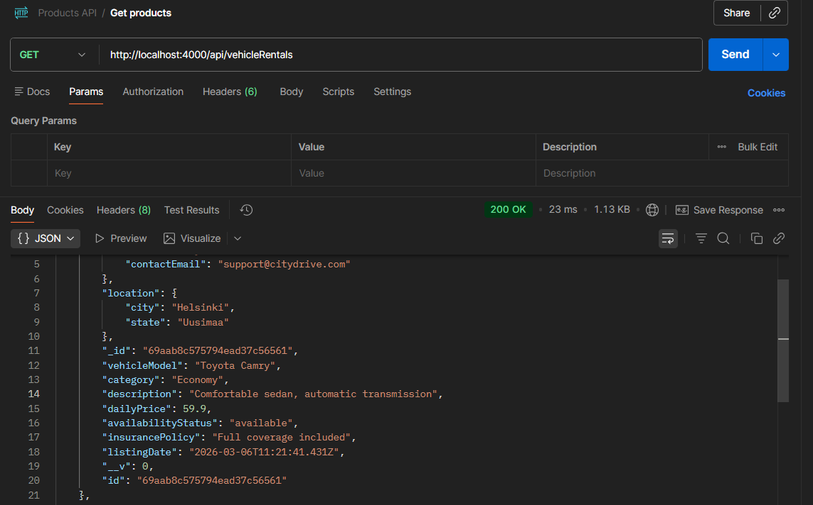
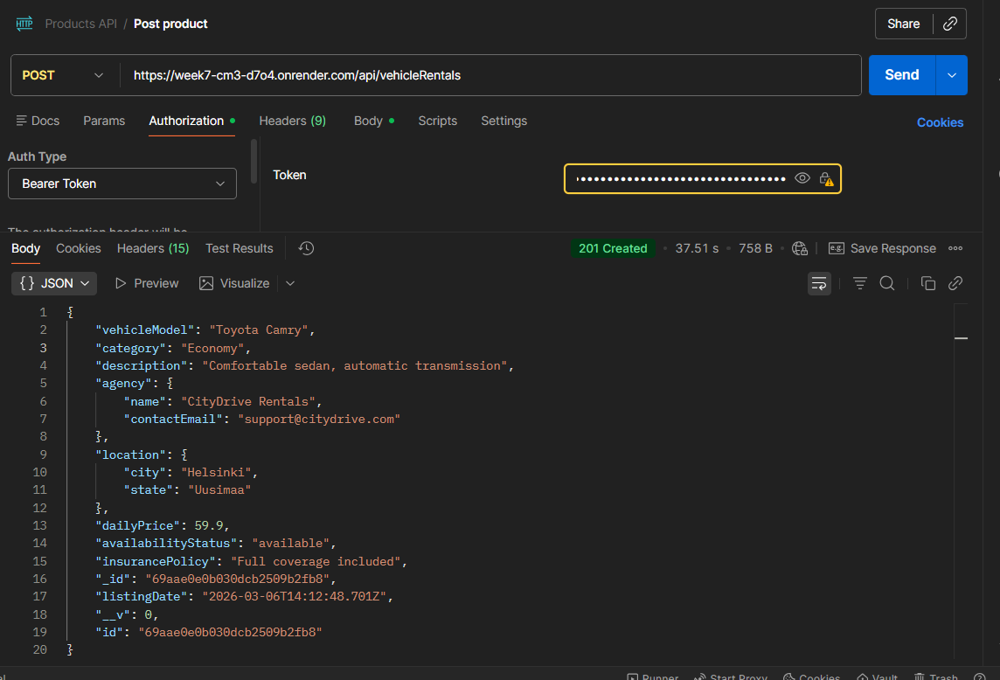

# Maria Kuznetsova - Contributions

## Features Implemented

I worked on the V2 backend API with authentication and testing.

### API V2 with Authentication
I implemented a second version of the backend API that includes authentication and protected routes.

The API includes the following endpoints for the VehicleRental resource:

- GET /api/vehicleRentals – Retrieve all vehicle rentals (public)
- GET /api/vehicleRentals/:id – Retrieve a specific vehicle rental (public)
- POST /api/vehicleRentals – Create a new vehicle rental (requires authentication)
- PUT /api/vehicleRentals/:id – Update a vehicle rental (requires authentication)
- DELETE /api/vehicleRentals/:id – Delete a vehicle rental (requires authentication)

Authentication is implemented using login tokens, and protected endpoints require a valid token to access.

### User Authentication

I implemented authentication endpoints for user management:

- POST /api/auth/signup – Register a new user
- POST /api/auth/login – Authenticate an existing user and return a token

These endpoints allow users to create accounts and access protected API routes.

### Backend Testing
I implemented automated tests using Jest and Supertest.

The tests include:

- Tests for all API V2 endpoints
- Authentication tests for protected routes
- Tests for successful responses
- Tests for error handling and edge cases

This ensures that the API works correctly under different scenarios.

### Deployment

I deployed Vehicle Rental APP V2 (With Authentication) to Render:

https://week7-cm3-d7o4.onrender.com/

### Database Setup

I configured the application to use separate MongoDB databases for API versions.

For local development:

- Tested the application using a local MongoDB database

For deployment:

- Created separate MongoDB Atlas databases for API V2

## Authored commits and pull requests

### Branhes 
- maria_backendV2
- maria_backendV2_testing

### Commits
- chore: initial commit
- feat: divide folders to V1 and V2
- feat(userControllers): Iteration 1 - add userController with Login and Signup
- feat(vehicleRentalControllers): Iteration 2 - update with getAllVehicleRentals, createVehicleRental, getVehicleRentalById, updateVehicleRental, deleteVehicleRental
- feat(vehicleRentalModel): Iteration 3 - update vehicleRentalModel
- feat(userModel): Iteration 4 - update userModel
- feat(vehicleRentalRouter): Iteration 5 - update vehicleRentalRouter with actual API endpoints
- feat(userRouter): Iteration 6 - update userRouter with actual API endpoints
- feat: Iteration 7 - create requireAuth and update app.js
- feat: Iteration 8 - create README file with info about API endpoints
- refactor: update endpoints
- refactor: update userController
- feat: Iteration 9 - create tests for the cars and users: include success cases, error handling, and edge cases
- feat: Iteration 10 - update README with example data
- feat: Iteration 11 - add my files to evaluation folder"

### Pull requests
- *#1* API V2 (With Authentication)
- *#3* Backend Testing (including authentication tests for protected routes)

## My role

My role in the project was to design and implement the V2 backend API with authentication.
I created protected CRUD endpoints, implemented user authentication (signup and login), and wrote automated tests using Jest and Supertest.

I also configured the application to use separate MongoDB databases for API V2, tested the application locally, and prepared the backend for cloud deployment.

